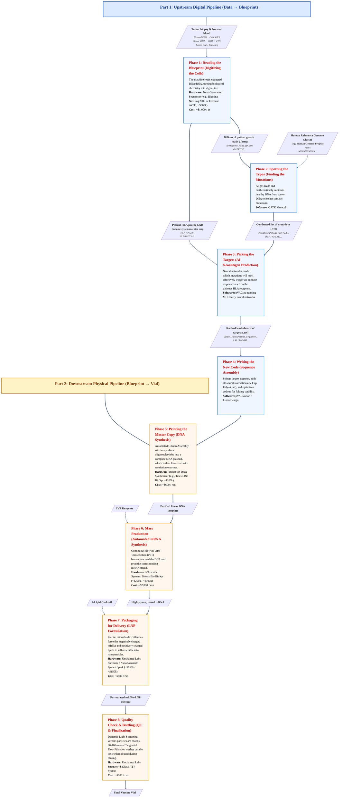

# System Architecture Diagram

This document contains the visual representation of the end-to-end mRNA cancer vaccine workflow.

```mermaid
%%{init: {'themeVariables': { 'fontSize': '16px', 'fontFamily': '-apple-system, BlinkMacSystemFont, Segoe UI, Inter, Roboto, Helvetica Neue, sans-serif' }}}%%
flowchart TD
    %% PART 1 %%
    Title1["<div style='font-size: 24px; font-weight: bold; margin-bottom: 20px; min-width: 1100px; text-align: center;'>📘 Part 1: Upstream Digital Pipeline (Data → Blueprint)</div>"]
    %% Phase 1
    Title1 ~~~ NodeIn1
    NodeIn1[/"<div style='font-size: 16px; font-weight: bold;'>Tumor biopsy & Normal blood</div><div style='font-size: 14px;'><i>Normal DNA: ~30X WES</i><br><i>Tumor DNA: ~100X+ WES</i><br><i>Tumor RNA: RNA-Seq</i></div>"/]
    NodeIn1 --> Phase1
    Phase1["<div style='font-size: 20px; font-weight: bold; color: #FF0000 !important; margin-bottom: 8px;'>Phase 1: Reading the Blueprint (Digitizing the Cells)</div><div style='color: #000000 !important;'>The machine reads extracted DNA/RNA, turning biological chemistry into digital text.<br><b>Hardware:</b> Next-Generation Sequencer (e.g., Illumina NextSeq 2000 or Element AVITI, ~$300k)<br><b>Cost:</b> ~$1,000 / pt</div>"]
    Phase1 --> NodeIn2
    NodeIn2[/"<div style='font-size: 16px; font-weight: bold;'>Billions of patient genetic reads (.fastq)</div><div style='font-size: 14px;'><i>@Machine_Read_ID_001<br>GATTTGG...</i></div>"/]
    
    %% Phase 2
    NodeRef[/"<div style='font-size: 16px; font-weight: bold;'>Human Reference Genome (.fasta)</div><div style='font-size: 14px;'><b>(e.g. Human Genome Project)</b><br><i>>chr1<br>NNNNNNNNNN...</i></div>"/]
    NodeIn2 --> Phase2
    NodeRef -.-> Phase2
    Phase2["<div style='font-size: 20px; font-weight: bold; color: #FF0000 !important; margin-bottom: 8px;'>Phase 2: Spotting the Typos (Finding the Mutations)</div><div style='color: #000000 !important;'>Aligns reads and mathematically subtracts healthy DNA from tumor DNA to isolate somatic mutations.<br><b>Software:</b> GATK Mutect2</div>"]
    Phase2 --> NodeIn3
    NodeIn3[/"<div style='font-size: 16px; font-weight: bold;'>Condensed list of mutations (.vcf)</div><div style='font-size: 14px;'><i>#CHROM POS ID REF ALT...<br>chr7 14045313...</i></div>"/]
    
    %% Phase 3
    NodeHLA[/"<div style='font-size: 16px; font-weight: bold;'>Patient HLA profile (.txt)</div><div style='font-size: 14px;'><b>Immune system receptor map</b><br><i>HLA-A*02:01<br>HLA-B*07:02...</i></div>"/]
    Phase1 --> NodeHLA
    NodeHLA -.-> Phase3
    NodeIn3 --> Phase3
    Phase3["<div style='font-size: 20px; font-weight: bold; color: #FF0000 !important; margin-bottom: 8px;'>Phase 3: Picking the Targets (AI Neoantigen Prediction)</div><div style='color: #000000 !important;'>Neural networks predict which mutations will most effectively trigger an immune response based on the patient's HLA receptors.<br><b>Software:</b> pVACseq running MHCflurry neural networks</div>"]
    Phase3 --> NodeIn4
    NodeIn4[/"<div style='font-size: 16px; font-weight: bold;'>Ranked leaderboard of targets (.tsv)</div><div style='font-size: 14px;'><i>Target_Rank Peptide_Sequence...<br>1 YLLPAIVHI...</i></div>"/]
    
    %% Phase 4
    NodeIn4 --> Phase4
    Phase4["<div style='font-size: 20px; font-weight: bold; color: #FF0000 !important; margin-bottom: 8px;'>Phase 4: Writing the New Code (Sequence Assembly)</div><div style='color: #000000 !important;'>Strings targets together, adds structural instructions (5' Cap, Poly-A tail), and optimizes codons for folding stability.<br><b>Software:</b> pVACvector + LinearDesign</div>"]
    
    %% PART 2 %%
    Title2["<div style='font-size: 24px; font-weight: bold; margin-bottom: 20px; min-width: 1100px; text-align: center;'>🧪 Part 2: Downstream Physical Pipeline (Blueprint → Vial)</div>"]
    %% Phase 5
    Title2 ~~~ Phase5
    Phase4 --> Phase5
    Phase5["<div style='font-size: 20px; font-weight: bold; color: #FF0000 !important; margin-bottom: 8px;'>Phase 5: Printing the Master Copy (DNA Synthesis)</div><div style='color: #000000 !important;'>Automated Gibson Assembly stitches synthetic oligonucleotides into a complete DNA plasmid, which is then linearized with restriction enzymes.<br><b>Hardware:</b> Benchtop DNA Synthesizer (e.g., Telesis Bio BioXp, ~$100k)<br><b>Cost:</b> ~$600 / rxn</div>"]
    Phase5 --> NodeIn6
    NodeIn6[/"<div style='font-size: 16px; font-weight: bold;'>Purified linear DNA template</div>"/]
    
    %% Phase 6
    NodeIVT[/"<div style='font-size: 16px; font-weight: bold;'>IVT Reagents</div>"/]
    NodeIVT -.-> Phase6
    NodeIn6 --> Phase6
    Phase6["<div style='font-size: 20px; font-weight: bold; color: #FF0000 !important; margin-bottom: 8px;'>Phase 6: Mass Production (Automated mRNA Synthesis)</div><div style='color: #000000 !important;'>Continuous-flow In Vitro Transcription (IVT) bioreactors read the DNA and print the corresponding mRNA strand.<br><b>Hardware:</b> NTxscribe System / Telesis Bio BioXp (~$250k / ~$100k)<br><b>Cost:</b> ~$2,000 / rxn</div>"]
    Phase6 --> NodeIn7
    NodeIn7[/"<div style='font-size: 16px; font-weight: bold;'>Highly pure, naked mRNA</div>"/]
    
    %% Phase 7
    NodeLipids[/"<div style='font-size: 16px; font-weight: bold;'>4-Lipid Cocktail</div>"/]
    NodeLipids -.-> Phase7
    NodeIn7 --> Phase7
    Phase7["<div style='font-size: 20px; font-weight: bold; color: #FF0000 !important; margin-bottom: 8px;'>Phase 7: Packaging for Delivery (LNP Formulation)</div><div style='color: #000000 !important;'>Precise microfluidic collisions force the negatively charged mRNA and positively charged lipids to self-assemble into nanoparticles.<br><b>Hardware:</b> Unchained Labs Sunshine / NanoAssemblr Ignite / Spark (~$150k / ~$150k)<br><b>Cost:</b> ~$500 / rxn</div>"]
    Phase7 --> NodeIn8
    NodeIn8[/"<div style='font-size: 16px; font-weight: bold;'>Formulated mRNA-LNP mixture</div>"/]
    
    %% Phase 8
    NodeIn8 --> Phase8
    Phase8["<div style='font-size: 20px; font-weight: bold; color: #FF0000 !important; margin-bottom: 8px;'>Phase 8: Quality Check & Bottling (QC & Finalization)</div><div style='color: #000000 !important;'>Dynamic Light Scattering verifies particles are exactly 60-100nm and Tangential Flow Filtration washes out the toxic ethanol used during mixing.<br><b>Hardware:</b> Unchained Labs Stunner (~$80k) & TFF System<br><b>Cost:</b> ~$100 / rxn</div>"]
    Phase8 --> NodeEnd
    NodeEnd[/"<div style='font-size: 16px; font-weight: bold;'>Final Vaccine Vial</div>"/]

    classDef processBlue fill:#EFF6FF,stroke:#3B82F6,stroke-width:2px,text-align:left,color:#1E3A5F;
    classDef processAmber fill:#FFF7ED,stroke:#F59E0B,stroke-width:2px,text-align:left,color:#78350F;
    classDef titleBlue fill:#DBEAFE,stroke:#2563EB,stroke-width:2px,color:#1E40AF;
    classDef titleAmber fill:#FEF3C7,stroke:#D97706,stroke-width:2px,color:#92400E;
    class Phase1,Phase2,Phase3,Phase4 processBlue;
    class Phase5,Phase6,Phase7,Phase8 processAmber;
    class Title1 titleBlue;
    class Title2 titleAmber;

    linkStyle default stroke:#64748B,stroke-width:3px
```
