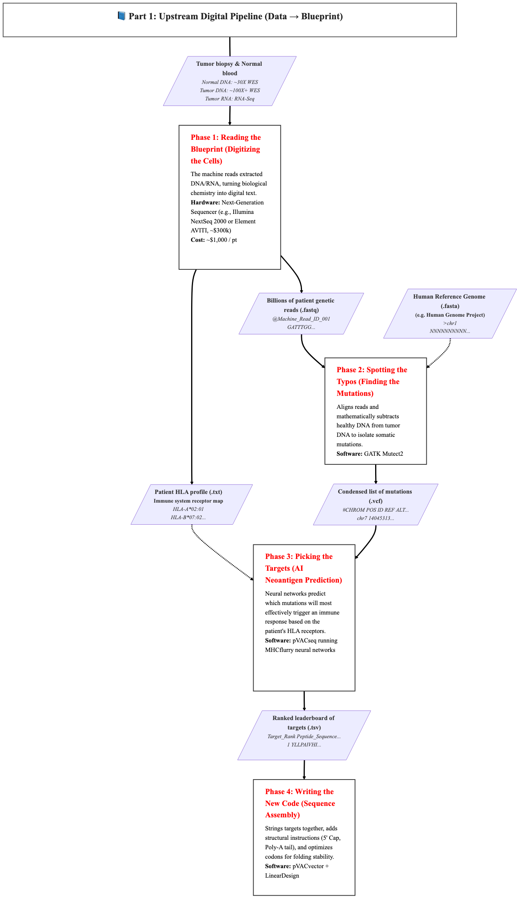
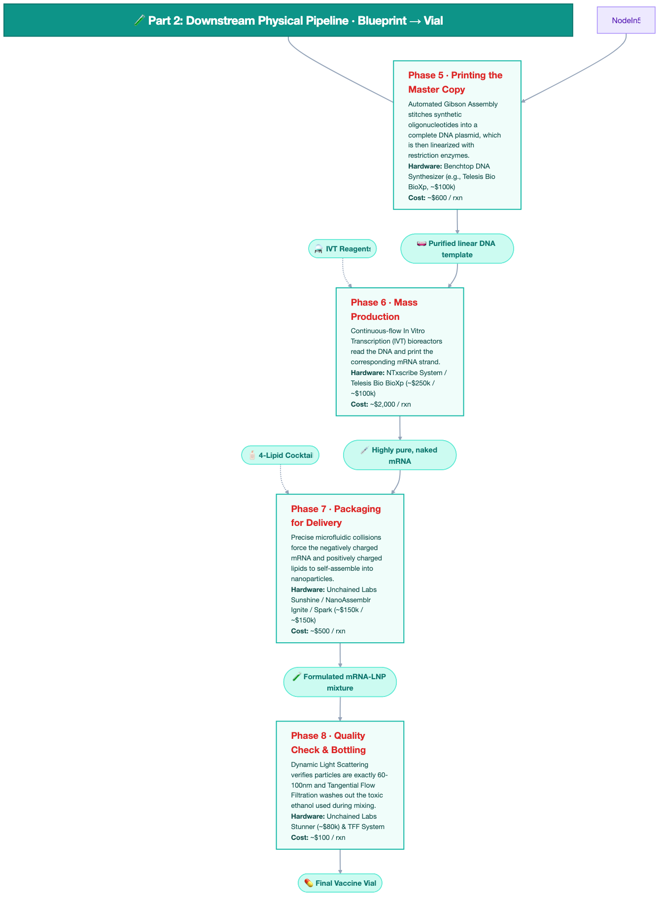

# mRNA Cancer Vaccine in Your Garage: An End-to-End Workflow

> [!CAUTION]
> **⚠️ RESEARCH & EDUCATION USE ONLY. NOT MEDICAL ADVICE.**
> This repository is a technical reference architecture for educational and research purposes only. Building and administering a personalized mRNA vaccine involves significant biological hazards, legal regulations, and requires regulatory oversight, institutional biosafety review, and qualified personnel. The authors do not advocate for the self-administration of any biological or medical products and assume no liability for the use or misuse of any information provided herein. Consult with qualified medical, scientific, and regulatory professionals before attempting any part of this workflow.

A complete reference architecture for building a personalized mRNA cancer vaccine from scratch—sequencer to syringe—entirely in your own lab. This repository documents every phase of the pipeline, from raw patient biopsies to a final injectable lipid nanoparticle (LNP) vaccine, including the specific software, benchtop hardware, and reagents required at each step.

# Table of Contents
- [System Architecture](#system-architecture)
- [Workflow, Part 1: Upstream Digital Pipeline ("Data to Blueprint")](#part-1-upstream-digital-pipeline-data-to-blueprint)
- [Workflow, Part 2: Downstream Physical Pipeline ("Blueprint to Vial")](#part-2-downstream-physical-pipeline-blueprint-to-vial)
- [Hardware & Reagent Stack Summary](#hardware--reagent-stack-summary)

---

# System Architecture

This pipeline is divided into two continuous halves:
1. **Data to Blueprint:** Ingests raw sequencing data, utilizes neural networks to identify immunogenic targets, and compiles a stabilized digital mRNA sequence.
2. **Blueprint to Vial:** Converts the digital `.fasta` sequence into physical DNA, automates In Vitro Transcription (IVT), and formulates the final LNP drug product.

### [Full System Architecture Diagram](ARCHITECTURE.md)




---

# Workflow, Part 1: Upstream Digital Pipeline ("Data to Blueprint")

## Phase 1: Reading the Blueprint (Digitizing the Cells)
**Goal:** Convert physical biological samples into unorganized genetic code to establish a baseline and identify tumor anomalies.
* **Hardware:** Next-Generation Sequencer (e.g., [Illumina NextSeq 2000](https://www.illumina.com/systems/sequencing-platforms/nextseq-1000-2000.html) or [Element AVITI](https://www.elementbiosciences.com/products/aviti), ~$300k)
* **Alt. (Outsourced):** Commercial labs (e.g., [Novogene](https://www.novogene.com/), [Azenta](https://www.azenta.com/), [Eurofins](https://www.eurofinsgenomics.com/)) or academic core facilities.
* **Est. Cost:** ~$1,000 / pt (In-House) or ~$2,500 / pt (Outsourced trio)
* **Inputs:** Tumor biopsy & Normal blood (healthy baseline).
  * **Normal Blood (DNA):** Whole Exome Sequencing (WES) at ~30X–50X depth.
  * **Tumor Biopsy (DNA):** WES at deep ~100X–500X coverage (to find rare solid tumor mutations).
  * **Tumor Biopsy (RNA):** RNA-Seq at ~50M–100M reads (to verify that the mutated genes are actually expressed).
* **Process:** The machine reads extracted DNA/RNA, turning biological chemistry into digital text.
* **Outputs:** 4 files including billions of short genetic reads and the patient's immune profile:
  1. `baseline-normal.fastq` — Normal blood WES (~30X–50X)
  2. `tumor-exome.fastq` — Tumor biopsy WES (~100X–500X)
  3. `tumor-rna.fastq` — Tumor biopsy RNA-Seq (~50M–100M reads)
  4. `patient-hla.txt` — Patient HLA profile (MHC Class I & II typing)
* **File Format:** `.fastq` & `.txt`
```text
@Patient_001:Baseline_Normal:1:1101:1234:5678
GATTTGGGGTTCAAAGCAGTATCGATCAAATAGTAAATCC
+
!''*((((***+))%%%++)(%%%%).1***-+*''))**
```

#### In-House vs. Outsourced Sequencing
If you don't want to buy and maintain a ~$300,000 sequencer, you can send physical samples (frozen tissue/blood) to a Contract Research Organization (CRO).

| Category | In-House (NextSeq 2000) | Outsourced (Service Lab) |
| --- | --- | --- |
| **Upfront Cost** | ~$300,000 (Hardware) | $0 |
| **Run Cost** | ~$1,000 / pt | ~$2,000 - $3,000 / pt |
| **Turnaround** | 24 - 48 hours | 2 - 4 weeks |
| **Complexity** | High (Requires specialized tech) | Low (Ship and wait) |
| **Typical Labs** | N/A | [Novogene](https://www.novogene.com/), [Azenta](https://www.azenta.com/), [Genewiz](https://www.genewiz.com/), [Eurofins](https://www.eurofinsgenomics.com/) |

## Phase 2: Spotting the Typos (Finding the Mutations)
**Goal:** Compare the healthy code against the tumor code to isolate specific cancer-causing errors.
* **Software:** [GATK Mutect2](https://github.com/broadinstitute/gatk)
* **Inputs:** 3 patient `.fastq` files (`baseline-normal`, `tumor-exome`, `tumor-rna`) + Human Reference Genome (`.fasta`).
* **Process:** Aligns reads and mathematically subtracts healthy DNA from tumor DNA to isolate somatic mutations.
* **Outputs:** 2 `.vcf` files containing a condensed list of specific genetic mutations:
  1. `somatic-variants.vcf` — All raw mutation candidates.
  2. `filtered-variants.vcf` — High-confidence, tumor-only mutations.
* **File Format:** `.vcf` (Variant Call Format)
```text
##fileformat=VCFv4.2
##source=Mutect2
##FILTER=<ID=PASS,Description="All filters passed">
#CHROM  POS       ID       REF  ALT  QUAL  FILTER  INFO
chr7    14045313  Mut_01   A    T    .     PASS    SOMATIC;DP=152;AF=0.24
```

## Phase 3: Picking the Targets (AI Neoantigen Prediction)
**Goal:** Use AI to predict which mutations the immune system will recognize as a threat.
* **Software:** [pVACseq](https://github.com/griffithlab/pVACtools) running [MHCflurry](https://github.com/openvax/mhcflurry) neural networks.
* **Inputs:** `filtered-variants.vcf` + Patient HLA profile (`.txt`).
* **Process:** Neural networks predict which mutations will most effectively trigger an immune response based on the patient's specific HLA receptors.
* **Outputs:** A ranked leaderboard of the best targets (neoantigens).
* **File Format:** `ranked-predictions.tsv`
```text
HLA_Allele  Peptide_Sequence  Best_MT_IC50_Score  Median_MT_IC50_Score  MHCflurry_EL_Score
HLA-A*02:01 YLLPAIVHI         24.5                32.1                  0.98
HLA-A*02:01 LLDVPTAAV         45.2                58.4                  0.92
HLA-B*07:02 APRGVFLLS         112.4               145.2                 0.85
```

## Phase 4: Writing the New Code (Sequence Assembly)
**Goal:** Compile the top predicted targets into a single, printable digital blueprint.
* **Software:** [pVACvector](https://github.com/griffithlab/pVACtools) + [LinearDesign](https://github.com/LinearDesignSoftware/LinearDesign)
* **Inputs:** Top targets from `ranked-predictions.tsv`.
* **Process:** Strings targets together, adds structural instructions (5' Cap, Poly-A tail), and optimizes codons for folding stability.
* **Outputs:** 1 `.fasta` file representing the complete, optimized mRNA blueprint.
  * `vaccine-construct.fasta` — Master mRNA sequence (5' UTR, Kozak, Start, Epitopes, Linkers, Stop, 3' UTR, Poly-A).
* **File Format:** `.fasta`
```text
>Patient_001_Custom_Vaccine_v1 | 5'UTR-Kozak-AUG-Epitopes-AAY_Linkers-Stop-3'UTR-PolyA
GGGAAAUAAGAGAGAAAAGAAGAGUAAGAAGAAAUAUAAGAGCCACCAUGGGCUACUUGCUGCCAGCGAU
UGUCCAUAUCCUCCUCUUCUUGGGCAAAAUUUGGCCGCUGCUUAUAUCCUCCUCUUCUUGGGCAAAAUUU
GGCCGCUGCUUAUAAAAAAAAAAAAAAAAAAAAAAAAAAAAAAAAAAAAAAAAAAAAAAAAAAAAAAAAA
```

---

# Workflow, Part 2: Downstream Physical Pipeline ("Blueprint to Vial")

## Phase 5: Printing the Master Copy (DNA Synthesis)
**Goal:** Convert the digital blueprint back into a physical, readable linear DNA template.
* **Hardware:** Benchtop DNA Synthesizer (e.g., [Telesis Bio BioXp](https://telesisbio.com/products/bioxp-system/), ~$100,000).
* **Alt. (Outsourced):** Custom gene synthesis (e.g., [Twist Bioscience](https://www.twistbioscience.com/), [IDT](https://www.idtdna.com/), [GenScript](https://www.genscript.com/), [Azenta](https://www.azenta.com/)).
* **Est. Cost:** ~$600 / rxn (In-House) or ~$200 - $900 (Outsourced gene)
* **Inputs:** The `.fasta` file.
* **Process:** Automated Gibson Assembly stitches synthetic oligonucleotides into a complete DNA plasmid, which is then linearized with restriction enzymes (e.g., BspQI).
* **Outputs:** ~1.5 mL of purified, linearized DNA template in a sterile 2.0 mL microcentrifuge tube.
  * **Yield:** ~75 µg of total DNA (typically at ~50 ng/µL concentration).
  * **Physical Form:** Clear, colorless liquid; stable at -20°C.
* **Key Reagents:** Oligonucleotides, BspQI restriction enzymes, AMPure XP purification beads.

#### DNA Synthesis: In-House vs. Outsourced
Ordering a synthetic gene is the industry standard for most research labs. However, in-house synthesis allows for faster iterations (hours vs. days).

| Category | In-House (BioXp) | Outsourced (Gene Synthesis) |
| --- | --- | --- |
| **Upfront Cost** | ~$100,000 (Hardware) | $0 |
| **Run Cost** | ~$600 / rxn | ~$200 - $900 / gene |
| **Turnaround** | 12 - 24 hours | 5 - 10 business days |
| **Complexity** | Moderate (Automated Benchtop) | Low (Upload sequence and wait) |
| **Typical Providers** | N/A | [Twist Bioscience](https://www.twistbioscience.com/), [IDT](https://www.idtdna.com/), [GenScript](https://www.genscript.com/), [Azenta](https://www.azenta.com/) |

## Phase 6: Mass Production (Automated mRNA Synthesis)
**Goal:** Execute the code by transcribing the DNA into functional, immune-cloaked mRNA.
* **Hardware:** [NTxscribe System](https://www.ntxbio.com/ntxscribe/) / [Telesis Bio BioXp](https://telesisbio.com/products/bioxp-system/) (~$250k / ~$100k).
* **Alt. (Outsourced):** Custom mRNA synthesis (e.g., [TriLink BioTechnologies](https://www.trilinkbiotech.com/), [GenScript](https://www.genscript.com/), [BiCell Scientific](https://bicellscientific.com/)).
* **Est. Cost:** ~$2,000 / rxn (In-House) or ~$1,000 - $3,000 / mg (Outsourced)
* **Inputs:** Linear DNA template + IVT Reagents.
* **Process:** Continuous-flow In Vitro Transcription (IVT) bioreactors read the DNA and print the corresponding mRNA strand.
* **Outputs:** ~5.0 mL of highly pure, naked mRNA in a sterile 15 mL conical tube.
  * **Yield:** ~1.0 mg of mRNA (typically at ~200 ng/µL concentration).
  * **Physical Form:** Slightly viscous, clear liquid; stored at -80°C.
* **Key Reagents:**
  * T7 RNA Polymerase (the "printer")
  * N1-methylpseudouridine (cloaking)
  * CleanCap® AG (human cell recognition)

#### mRNA Synthesis: In-House vs. Outsourced
In-house synthesis is ideal for rapid prototyping and total control over the capping and tailing process. However, for a "garage" setup, ordering the final mRNA construct is often the most practical path.

| Category | In-House (NTxscribe) | Outsourced (Custom mRNA) |
| --- | --- | --- |
| **Upfront Cost** | ~$250,000 (Hardware) | $0 |
| **Run Cost** | ~$2,000 / rxn | ~$1,000 - $3,000 / mg |
| **Turnaround** | < 24 hours | 1 - 3 weeks |
| **Complexity** | High (Requires IVT expertise) | Low (Upload sequence and wait) |
| **Typical Providers** | N/A | [TriLink](https://www.trilinkbiotech.com/), [GenScript](https://www.genscript.com/), [BiCell Scientific](https://bicellscientific.com/) |

## Phase 7: Packaging for Delivery (LNP Formulation)
**Goal:** Wrap the fragile mRNA in a protective lipid nanoparticle to allow human cell entry.
* **Hardware:** [Unchained Labs Sunshine](https://www.unchainedlabs.com/sunshine/) / [NanoAssemblr Ignite / Spark](https://www.cytivalifesciences.com/en/us/solutions/genomic-medicine/brands/nanoassemblr/ignite) (~$150k / ~$150k).
* **Alt. (Outsourced):** LNP formulation CROs (e.g., [VectorBuilder](https://www.vectorbuilder.com/), [Creative Biogene](https://www.creative-biogene.com/), [Lonza](https://www.lonza.com/), [Vernal Biosciences](https://www.vernal.bio/)).
* **Est. Cost:** ~$500 / rxn (In-House) or ~$2,000 - $5,000 / batch (Outsourced)
* **Inputs:** Purified mRNA + 4-Lipid Cocktail.
* **Process:** Precise microfluidic collisions force the negatively charged mRNA and positively charged lipids to self-assemble into nanoparticles.
* **Outputs:** ~10–12 mL of raw mRNA-LNP mixture in a sterile 50 mL centrifuge tube.
  * **Yield:** ~0.9 mg of encapsulated mRNA (>90% encapsulation efficiency).
  * **Physical Form:** Opalescent, slightly milky liquid (contains ~25% ethanol before filtration).
* **Key Reagents:** Ionizable Lipid (e.g., ALC-0315), PEG-Lipid, DSPC (Helper Lipid), Cholesterol, Ethanol, Acidic Buffer.

#### LNP Formulation: In-House vs. Outsourced
Packaging mRNA into stable LNPs is one of the most technically challenging steps. Outsourcing to a CRO guarantees professional-grade encapsulation and characterization.

| Category | In-House (Sunshine/Ignite) | Outsourced (LNP CRO) |
| --- | --- | --- |
| **Upfront Cost** | ~$150,000 (Hardware) | $0 |
| **Run Cost** | ~$500 / rxn | ~$2,000 - $5,000 / batch |
| **Turnaround** | < 24 hours | 2 - 4 weeks |
| **Complexity** | High (Microfluidics optimization) | Low (Send mRNA and wait) |
| **Typical Providers** | N/A | [VectorBuilder](https://www.vectorbuilder.com/), [Creative Biogene](https://www.creative-biogene.com/), [Lonza](https://www.lonza.com/), [Vernal](https://www.vernal.bio/) |

## Phase 8: Quality Check & Bottling (QC & Finalization)
**Goal:** Validate structural integrity, size, and concentration before finalizing for injection.
* **Hardware:** [Unchained Labs Stunner](https://www.unchainedlabs.com/stunner/) (~$80,000) & TFF System.
* **Alt. (Outsourced):** Analytical & Purification services (e.g., [CordenPharma](https://www.cordenpharma.com/), [PreciGenome](https://www.precigenome.com/), [uBriGene](https://www.ubrigene.com/), [VectorBuilder](https://www.vectorbuilder.com/), [RIBOPRO](https://ribopro.eu/)).
* **Est. Cost:** ~$100 / rxn (In-House) or ~$1,000 - $3,000 / batch (Outsourced)
* **Inputs:** Raw mRNA-LNP mixture.
* **Process:**
  * **Stunner:** Dynamic Light Scattering (DLS) verifies particles are exactly 60–100nm.
  * **TFF:** Tangential Flow Filtration washes out the toxic ethanol used during mixing.
* **Outputs:** 10 x 1.0 mL sterile, glass vials (approx. 10 doses).
  * **Concentration:** ~100 µg/mL of encapsulated mRNA.
  * **Physical Form:** Clear to slightly opalescent liquid; stored at -80°C in a cryoprotectant buffer.
* **Key Reagents:** Tris-Sucrose Buffer (cryoprotectant), RiboGreen Assay (encapsulation verification).

#### LNP Quality Control: In-House vs. Outsourced
Final validation is critical for safety and efficacy. While benchtop tools like the Stunner provide instant feedback, CROs offer comprehensive analytical reports suitable for regulatory filing.

| Category | In-House (Stunner + TFF) | Outsourced (Analytical CRO) |
| --- | --- | --- |
| **Upfront Cost** | ~$100,000 (Hardware) | $0 |
| **Run Cost** | ~$100 / rxn | ~$1,000 - $3,000 / batch |
| **Turnaround** | < 12 hours | 1 - 3 weeks |
| **Complexity** | Moderate (Requires precise assay prep) | Low (Send sample and wait) |
| **Typical Providers** | N/A | [CordenPharma](https://www.cordenpharma.com/), [PreciGenome](https://www.precigenome.com/), [uBriGene](https://www.ubrigene.com/), [RIBOPRO](https://ribopro.eu/) |

---

# Hardware & Reagent Bill of Materials

| Phase | Subsystem | In-House Hardware | HW Cost | Outsourced Alt | Est. Run Cost (In-House vs. Out) | Est. Time (In-House vs. Out) |
| --- | --- | --- | --- | --- | --- | --- |
| 1 | Sequencing | [NextSeq 2000](https://www.illumina.com/systems/sequencing-platforms/nextseq-1000-2000.html) | ~$300k | [Novogene](https://www.novogene.com/), [Azenta](https://www.azenta.com/) | ~$1,000 vs. ~$2,500 / pt | 1-2 Days vs. 2-4 Weeks |
| 5 | DNA Prep | [BioXp System](https://telesisbio.com/products/bioxp-system/) | ~$100k | [Twist](https://www.twistbioscience.com/), [IDT](https://www.idtdna.com/), [GenScript](https://www.genscript.com/) | ~$600 vs. ~$200-$900 / gene | 1 Day vs. 1-2 Weeks |
| 6 | mRNA Synth | [NTxscribe](https://www.ntxbio.com/ntxscribe/) | ~$250k | [TriLink](https://www.trilinkbiotech.com/), [GenScript](https://www.genscript.com/) | ~$2,000 vs. ~$1k-$3k / mg | 1 Day vs. 1-3 Weeks |
| 7 | LNP Mix | [Sunshine](https://www.unchainedlabs.com/sunshine/) | ~$150k | [VectorBuilder](https://www.vectorbuilder.com/), [Lonza](https://www.lonza.com/) | ~$500 vs. ~$2k-$5k / batch | 1 Day vs. 2-4 Weeks |
| 8 | Validation | [Stunner](https://www.unchainedlabs.com/stunner/) | ~$80k | [CordenPharma](https://www.cordenpharma.com/), [uBriGene](https://www.ubrigene.com/) | ~$100 vs. ~$1k-$3k / batch | <12 Hours vs. 1-3 Weeks |

---

## License

This project is licensed under the Apache License 2.0 - see the [LICENSE](LICENSE) file for details.