# mRNA Cancer Vaccine in Your Garage: An End-to-End Workflow

A complete reference architecture for building a personalized mRNA cancer vaccine from scratch—sequencer to syringe—entirely in your own lab. This repository documents every phase of the pipeline, from raw patient biopsies to a final injectable lipid nanoparticle (LNP) vaccine, including the specific software, benchtop hardware, and reagents required at each step.

# Table of Contents
- [System Architecture](#system-architecture)
- [Workflow, Part 1: Upstream Digital Pipeline ("Data to Blueprint")](#part-1-upstream-digital-pipeline-data-to-blueprint)
- [Workflow, Part 2: Downstream Physical Pipeline ("Blueprint to Vial")](#part-2-downstream-physical-pipeline-blueprint-to-vial)
- [Hardware & Reagent Stack Summary](#hardware--reagent-stack-summary)

---

# System Architecture

This pipeline is divided into two continuous halves:
1. **Data to Blueprint:** Ingests raw sequencing data, utilizes neural networks to identify immunogenic targets, and compiles a stabilized digital mRNA sequence.
2. **Blueprint to Vial:** Converts the digital `.fasta` sequence into physical DNA, automates In Vitro Transcription (IVT), and formulates the final LNP drug product.

```mermaid
flowchart TD
    subgraph P1[" "]
    direction TB
    Title1["<strong style='font-size: 1.4em; display:inline-block; min-width:900px; text-align:center;'>📘 Part 1: Upstream Digital Pipeline (Data → Blueprint)</strong>"]
    %% Phase 1
    Title1 ~~~ NodeIn1
    NodeIn1[/"<strong style='font-size: 1.1em;'>Tumor biopsy & Normal blood</strong><br><i>Normal DNA: ~30X WES</i><br><i>Tumor DNA: ~100X+ WES</i><br><i>Tumor RNA: RNA-Seq</i>"/] --> Phase1["<strong style='font-size: 1.2em; color: red;'>Phase 1: Reading the Blueprint (Digitizing the Cells)</strong><br><span style='color: black;'>The machine reads extracted DNA/RNA, turning biological chemistry into digital text.</span><br><span style='color: black;'><b>Hardware:</b> Next-Generation Sequencer (e.g., Illumina NextSeq 2000 or Element AVITI, ~$300k)<br><b>Cost:</b> ~$1,000 / pt</span>"]
    Phase1 --> NodeIn2[/"<strong style='font-size: 1.1em;'>Billions of patient genetic reads (.fastq)</strong><br><i>@Machine_Read_ID_001<br>GATTTGG...</i>"/]
    
    %% Phase 2
    NodeRef[/"<strong style='font-size: 1.1em;'>Human Reference Genome (.fasta)</strong><br><b>(e.g. Human Genome Project)</b><br><i>>chr1<br>NNNNNNNNNN...</i>"/] -.-> Phase2
    NodeIn2 --> Phase2["<strong style='font-size: 1.2em; color: red;'>Phase 2: Spotting the Typos (Finding the Mutations)</strong><br><span style='color: black;'>Aligns reads and mathematically subtracts healthy DNA from tumor DNA to isolate somatic mutations.</span><br><span style='color: black;'><b>Software:</b> GATK Mutect2</span>"]
    Phase2 --> NodeIn3[/"<strong style='font-size: 1.1em;'>Condensed list of mutations (.vcf)</strong><br><i>#CHROM POS ID REF ALT...<br>chr7 14045313...</i>"/]
    
    %% Phase 3
    NodeHLA[/"<strong style='font-size: 1.1em;'>Patient HLA profile (.txt)</strong><br><b>Immune system receptor map</b><br><i>HLA-A*02:01<br>HLA-B*07:02...</i>"/] -.-> Phase3
    Phase1 --> NodeHLA
    NodeIn3 --> Phase3["<strong style='font-size: 1.2em; color: red;'>Phase 3: Picking the Targets (AI Neoantigen Prediction)</strong><br><span style='color: black;'>Neural networks predict which mutations will most effectively trigger an immune response based on the patient's HLA receptors.</span><br><span style='color: black;'><b>Software:</b> pVACseq running MHCflurry neural networks</span>"]
    Phase3 --> NodeIn4[/"<strong style='font-size: 1.1em;'>Ranked leaderboard of targets (.tsv)</strong><br><i>Target_Rank Peptide_Sequence...<br>1 YLLPAIVHI...</i>"/]
    
    %% Phase 4
    NodeIn4 --> Phase4["<strong style='font-size: 1.2em; color: red;'>Phase 4: Writing the New Code (Sequence Assembly)</strong><br><span style='color: black;'>Strings targets together, adds structural instructions (5' Cap, Poly-A tail), and optimizes codons for folding stability.</span><br><span style='color: black;'><b>Software:</b> pVACvector + LinearDesign</span>"]
    Phase4 --> NodeIn5[/"<strong style='font-size: 1.1em;'>Master digital vaccine sequence (.fasta)</strong><br><i>>Patient_001_Construct...<br>AUGGGCUACU...</i>"/]
    end
    
    subgraph P2[" "]
    direction TB
    Title2["<strong style='font-size: 1.4em; display:inline-block; min-width:900px; text-align:center;'>🧪 Part 2: Downstream Physical Pipeline (Blueprint → Vial)</strong>"]
    %% Phase 5
    Title2 ~~~ Phase5
    NodeIn5 --> Phase5["<strong style='font-size: 1.2em; color: red;'>Phase 5: Printing the Master Copy (DNA Synthesis)</strong><br><span style='color: black;'>Automated Gibson Assembly stitches synthetic oligonucleotides into a complete DNA plasmid, which is then linearized with restriction enzymes.</span><br><span style='color: black;'><b>Hardware:</b> Benchtop DNA Synthesizer (e.g., Telesis Bio BioXp, ~$100k)<br><b>Cost:</b> ~$600 / rxn</span>"]
    Phase5 --> NodeIn6[/"<strong style='font-size: 1.1em;'>Purified linear DNA template</strong>"/]
    
    %% Phase 6
    NodeIVT[/"<strong style='font-size: 1.1em;'>IVT Reagents</strong>"/] -.-> Phase6
    NodeIn6 --> Phase6["<strong style='font-size: 1.2em; color: red;'>Phase 6: Mass Production (Automated mRNA Synthesis)</strong><br><span style='color: black;'>Continuous-flow In Vitro Transcription (IVT) bioreactors read the DNA and print the corresponding mRNA strand.</span><br><span style='color: black;'><b>Hardware:</b> NTxscribe System / Telesis Bio BioXp (~$250k / ~$100k)<br><b>Cost:</b> ~$2,000 / rxn</span>"]
    Phase6 --> NodeIn7[/"<strong style='font-size: 1.1em;'>Highly pure, naked mRNA</strong>"/]
    
    %% Phase 7
    NodeLipids[/"<strong style='font-size: 1.1em;'>4-Lipid Cocktail</strong>"/] -.-> Phase7
    NodeIn7 --> Phase7["<strong style='font-size: 1.2em; color: red;'>Phase 7: Packaging for Delivery (LNP Formulation)</strong><br><span style='color: black;'>Precise microfluidic collisions force the negatively charged mRNA and positively charged lipids to self-assemble into nanoparticles.</span><br><span style='color: black;'><b>Hardware:</b> Unchained Labs Sunshine / NanoAssemblr Ignite / Spark (~$150k / ~$150k)<br><b>Cost:</b> ~$500 / rxn</span>"]
    Phase7 --> NodeIn8[/"<strong style='font-size: 1.1em;'>Formulated mRNA-LNP mixture</strong>"/]
    
    %% Phase 8
    NodeIn8 --> Phase8["<strong style='font-size: 1.2em; color: red;'>Phase 8: Quality Check & Bottling (QC & Finalization)</strong><br><span style='color: black;'>Dynamic Light Scattering verifies particles are exactly 60-100nm and Tangential Flow Filtration washes out the toxic ethanol used during mixing.</span><br><span style='color: black;'><b>Hardware:</b> Unchained Labs Stunner (~$80k) & TFF System<br><b>Cost:</b> ~$100 / rxn</span>"]
    Phase8 --> NodeEnd[/"<strong style='font-size: 1.1em;'>Final Vaccine Vial</strong>"/]
    end

    classDef process fill:#f9f9f9,stroke:#333,stroke-width:2px,text-align:left;
    classDef titleNode fill:#e8e8e8,stroke:#555,stroke-width:2px,color:#222,font-size:16px;
    class Phase1,Phase2,Phase3,Phase4,Phase5,Phase6,Phase7,Phase8 process;
    class Title1,Title2 titleNode;

    style P1 fill:#f0f8ff,stroke:#336,stroke-width:3px
    style P2 fill:#fff8f0,stroke:#633,stroke-width:3px
    linkStyle default stroke:#000,stroke-width:4px
```



---

# Workflow, Part 1: Upstream Digital Pipeline ("Data to Blueprint")

### Phase 1: Reading the Blueprint (Digitizing the Cells)
**Goal:** Convert physical biological samples into unorganized genetic code to establish a baseline and identify tumor anomalies.
* **Hardware:** Next-Generation Sequencer (e.g., Illumina NextSeq 2000 or Element AVITI, ~$300k)
* **Est. Cost:** ~$1,000 / pt
* **Inputs:** Tumor biopsy & Normal blood (healthy baseline).
  * **Normal Blood (DNA):** Whole Exome Sequencing (WES) at ~30X–50X depth.
  * **Tumor Biopsy (DNA):** WES at deep ~100X–500X coverage (to find rare solid tumor mutations).
  * **Tumor Biopsy (RNA):** RNA-Seq at ~50M–100M reads (to verify that the mutated genes are actually expressed).
* **Process:** The machine reads extracted DNA/RNA, turning biological chemistry into digital text.
* **Outputs:** Billions of short, unorganized genetic reads.
* **File Format:** `.fastq`
```text
@Machine_Read_ID_001
GATTTGGGGTTCAAAGCAGTATCGATCAAATAGTAAATCC
+
!''*((((***+))%%%++)(%%%%).1***-+*''))**
```

### Phase 2: Spotting the Typos (Finding the Mutations)
**Goal:** Compare the healthy code against the tumor code to isolate specific cancer-causing errors.
* **Software:** [GATK Mutect2](https://github.com/broadinstitute/gatk)
* **Inputs:** Patient `.fastq` + Human Reference Genome.
* **Process:** Aligns reads and mathematically subtracts healthy DNA from tumor DNA to isolate somatic mutations.
* **Outputs:** A condensed list of specific genetic mutations.
* **File Format:** `.vcf` (Variant Call Format)
```text
#CHROM  POS       ID       REF  ALT  QUAL  FILTER  INFO
chr7    14045313  Mut_01   A    T    99    PASS    Somatic;TumorOnly
```

### Phase 3: Picking the Targets (AI Neoantigen Prediction)
**Goal:** Use AI to predict which mutations the immune system will recognize as a threat.
* **Software:** [pVACseq](https://github.com/griffithlab/pVACtools) running [MHCflurry](https://github.com/openvax/mhcflurry) neural networks.
* **Inputs:** `.vcf` mutation list + Patient HLA profile.
* **Process:** Neural networks predict which mutations will most effectively trigger an immune response based on the patient's specific HLA receptors.
* **Outputs:** A ranked leaderboard of the best targets (neoantigens).
* **File Format:** `.tsv`
```text
Target_Rank  Peptide_Sequence  HLA_Type  Affinity_Score_nM
1            YLLPAIVHI         HLA-A*02  24.5
```

### Phase 4: Writing the New Code (Sequence Assembly)
**Goal:** Compile the top predicted targets into a single, printable digital blueprint.
* **Software:** [pVACvector](https://github.com/griffithlab/pVACtools) + [LinearDesign](https://github.com/LinearDesignSoftware/LinearDesign)
* **Inputs:** Top targets from `.tsv`.
* **Process:** Strings targets together, adds structural instructions (5' Cap, Poly-A tail), and optimizes codons for folding stability.
* **Outputs:** The master digital sequence of the mRNA vaccine.
* **File Format:** `.fasta` (The master manufacturing blueprint)
```text
>Patient_001_Custom_Vaccine_Construct_v1
AUGGGCUACUUGCUGCCAGCGAUUGUCCAUAUCCUCCUCUUCUUGGGCAAAAUUUGGCCG...
```

---

# Workflow, Part 2: Downstream Physical Pipeline ("Blueprint to Vial")

### Phase 5: Printing the Master Copy (DNA Synthesis)
**Goal:** Convert the digital blueprint back into a physical, readable linear DNA template.
* **Hardware:** Benchtop DNA Synthesizer (e.g., Telesis Bio BioXp, ~$100,000).
* **Est. Cost:** ~$600 / rxn
* **Inputs:** The `.fasta` file.
* **Process:** Automated Gibson Assembly stitches synthetic oligonucleotides into a complete DNA plasmid, which is then linearized with restriction enzymes (e.g., BspQI).
* **Outputs:** Physical, purified linear DNA template.
* **Key Reagents:** Oligonucleotides, BspQI restriction enzymes, AMPure XP purification beads.

### Phase 6: Mass Production (Automated mRNA Synthesis)
**Goal:** Execute the code by transcribing the DNA into functional, immune-cloaked mRNA.
* **Hardware:** NTxscribe System / Telesis Bio BioXp (~$250k / ~$100k).
* **Est. Cost:** ~$2,000 / rxn
* **Inputs:** Linear DNA template + IVT Reagents.
* **Process:** Continuous-flow In Vitro Transcription (IVT) bioreactors read the DNA and print the corresponding mRNA strand.
* **Outputs:** Highly pure, naked mRNA.
* **Key Reagents:**
  * T7 RNA Polymerase (the "printer")
  * N1-methylpseudouridine (cloaking)
  * CleanCap® AG (human cell recognition)

### Phase 7: Packaging for Delivery (LNP Formulation)
**Goal:** Wrap the fragile mRNA in a protective lipid nanoparticle to allow human cell entry.
* **Hardware:** Unchained Labs Sunshine / NanoAssemblr Ignite / Spark (~$150k / ~$150k).
* **Est. Cost:** ~$500 / rxn
* **Inputs:** Purified mRNA + 4-Lipid Cocktail.
* **Process:** Precise microfluidic collisions force the negatively charged mRNA and positively charged lipids to self-assemble into nanoparticles.
* **Outputs:** Formulated mRNA Lipid Nanoparticles (LNPs).
* **Key Reagents:** Ionizable Lipid (e.g., ALC-0315), PEG-Lipid, DSPC (Helper Lipid), Cholesterol, Ethanol, Acidic Buffer.

### Phase 8: Quality Check & Bottling (QC & Finalization)
**Goal:** Validate structural integrity, size, and concentration before finalizing for injection.
* **Hardware:** Unchained Labs Stunner (~$80,000) & TFF System.
* **Est. Cost:** ~$100 / rxn
* **Inputs:** Raw mRNA-LNP mixture.
* **Process:**
  * **Stunner:** Dynamic Light Scattering (DLS) verifies particles are exactly 60–100nm.
  * **TFF:** Tangential Flow Filtration washes out the toxic ethanol used during mixing.
* **Outputs:** Final, injectable, personalized cancer vaccine suspended in a cryoprotectant.
* **Key Reagents:** Tris-Sucrose Buffer (cryoprotectant), RiboGreen Assay (encapsulation verification).

---

# Hardware & Reagent Bill of Materials

| Phase | Subsystem | Primary Hardware | Est. HW Cost (new) | Core Consumables | Est. Run Cost |
| --- | --- | --- | --- | --- | --- |
| 1 | Sequencing | Illumina NextSeq 2000 / Element AVITI | ~$300,000 | Extraction Kits, Flow Cells | ~$1,000 / pt |
| 5 | DNA Prep | Telesis Bio BioXp | ~$100,000 | Gibson Kits, AMPure XP Beads | ~$600 / rxn |
| 6 | mRNA Synth | NTxscribe / Telesis Bio BioXp | ~$250k / ~$100k | T7 Polymerase, Mod-NTPs, CleanCap | ~$2,000 / rxn |
| 7 | LNP Mix | Unchained Labs Sunshine / NanoAssemblr Ignite / Spark | ~$150k / ~$150k | Sunny Chips, 4-Lipid Cocktail | ~$500 / rxn |
| 8 | Validation | Unchained Labs Stunner | ~$80,000 | Stunner Plates, RiboGreen Assay | ~$100 / rxn |