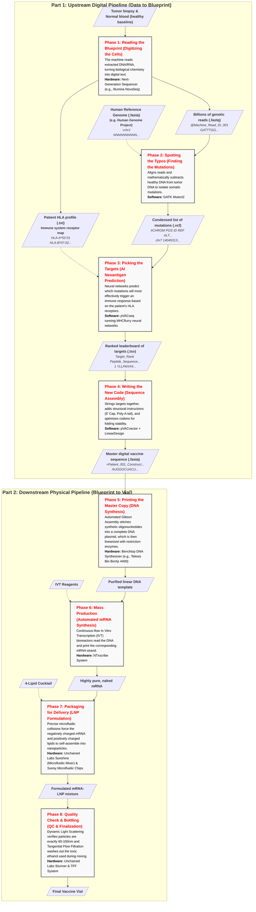

# mRNA Cancer Vaccine End-to-End Workflow

```mermaid
flowchart TD
    subgraph "<strong><div style='font-size: 1.5em; min-width: 800px;'>Part 1: Upstream Digital Pipeline (Data to Blueprint)</div></strong>"
    %% Phase 1
    NodeIn1[/"<strong style='font-size: 1.1em;'>Tumor biopsy & Normal blood (healthy baseline)</strong>"/] --> Phase1["<strong style='font-size: 1.2em; color: red;'>Phase 1: Reading the Blueprint (Digitizing the Cells)</strong><br><span style='color: black;'>The machine reads extracted DNA/RNA, turning biological chemistry into digital text.</span><br><span style='color: black;'><b>Hardware:</b> Next-Generation Sequencer (e.g., Illumina NovaSeq)</span>"]
    Phase1 --> NodeIn2[/"<strong style='font-size: 1.1em;'>Billions of genetic reads (.fastq)</strong><br><i>@Machine_Read_ID_001<br>GATTTGG...</i>"/]
    
    %% Phase 2
    NodeRef[/"<strong style='font-size: 1.1em;'>Human Reference Genome (.fasta)</strong><br><b>(e.g. Human Genome Project)</b><br><i>>chr1<br>NNNNNNNNNN...</i>"/] -.-> Phase2
    NodeIn2 --> Phase2["<strong style='font-size: 1.2em; color: red;'>Phase 2: Spotting the Typos (Finding the Mutations)</strong><br><span style='color: black;'>Aligns reads and mathematically subtracts healthy DNA from tumor DNA to isolate somatic mutations.</span><br><span style='color: black;'><b>Software:</b> GATK Mutect2</span>"]
    Phase2 --> NodeIn3[/"<strong style='font-size: 1.1em;'>Condensed list of mutations (.vcf)</strong><br><i>#CHROM POS ID REF ALT...<br>chr7 14045313...</i>"/]
    
    %% Phase 3
    NodeHLA[/"<strong style='font-size: 1.1em;'>Patient HLA profile (.txt)</strong><br><b>Immune system receptor map</b><br><i>HLA-A*02:01<br>HLA-B*07:02...</i>"/] -.-> Phase3
    Phase1 --> NodeHLA
    NodeIn3 --> Phase3["<strong style='font-size: 1.2em; color: red;'>Phase 3: Picking the Targets (AI Neoantigen Prediction)</strong><br><span style='color: black;'>Neural networks predict which mutations will most effectively trigger an immune response based on the patient's HLA receptors.</span><br><span style='color: black;'><b>Software:</b> pVACseq running MHCflurry neural networks</span>"]
    Phase3 --> NodeIn4[/"<strong style='font-size: 1.1em;'>Ranked leaderboard of targets (.tsv)</strong><br><i>Target_Rank Peptide_Sequence...<br>1 YLLPAIVHI...</i>"/]
    
    %% Phase 4
    NodeIn4 --> Phase4["<strong style='font-size: 1.2em; color: red;'>Phase 4: Writing the New Code (Sequence Assembly)</strong><br><span style='color: black;'>Strings targets together, adds structural instructions (5' Cap, Poly-A tail), and optimizes codons for folding stability.</span><br><span style='color: black;'><b>Software:</b> pVACvector + LinearDesign</span>"]
    Phase4 --> NodeIn5[/"<strong style='font-size: 1.1em;'>Master digital vaccine sequence (.fasta)</strong><br><i>>Patient_001_Construct...<br>AUGGGCUACU...</i>"/]
    end
    
    subgraph "<strong><div style='font-size: 1.5em; min-width: 800px;'>Part 2: Downstream Physical Pipeline (Blueprint to Vial)</div></strong>"
    %% Phase 5
    NodeIn5 --> Phase5["<strong style='font-size: 1.2em; color: red;'>Phase 5: Printing the Master Copy (DNA Synthesis)</strong><br><span style='color: black;'>Automated Gibson Assembly stitches synthetic oligonucleotides into a complete DNA plasmid, which is then linearized with restriction enzymes.</span><br><span style='color: black;'><b>Hardware:</b> Benchtop DNA Synthesizer (e.g., Telesis Bio BioXp 4400)</span>"]
    Phase5 --> NodeIn6[/"<strong style='font-size: 1.1em;'>Purified linear DNA template</strong>"/]
    
    %% Phase 6
    NodeIVT[/"<strong style='font-size: 1.1em;'>IVT Reagents</strong>"/] -.-> Phase6
    NodeIn6 --> Phase6["<strong style='font-size: 1.2em; color: red;'>Phase 6: Mass Production (Automated mRNA Synthesis)</strong><br><span style='color: black;'>Continuous-flow In Vitro Transcription (IVT) bioreactors read the DNA and print the corresponding mRNA strand.</span><br><span style='color: black;'><b>Hardware:</b> NTxscribe System</span>"]
    Phase6 --> NodeIn7[/"<strong style='font-size: 1.1em;'>Highly pure, naked mRNA</strong>"/]
    
    %% Phase 7
    NodeLipids[/"<strong style='font-size: 1.1em;'>4-Lipid Cocktail</strong>"/] -.-> Phase7
    NodeIn7 --> Phase7["<strong style='font-size: 1.2em; color: red;'>Phase 7: Packaging for Delivery (LNP Formulation)</strong><br><span style='color: black;'>Precise microfluidic collisions force the negatively charged mRNA and positively charged lipids to self-assemble into nanoparticles.</span><br><span style='color: black;'><b>Hardware:</b> Unchained Labs Sunshine (Microfluidic Mixer) & Sunny Microfluidic Chips</span>"]
    Phase7 --> NodeIn8[/"<strong style='font-size: 1.1em;'>Formulated mRNA-LNP mixture</strong>"/]
    
    %% Phase 8
    NodeIn8 --> Phase8["<strong style='font-size: 1.2em; color: red;'>Phase 8: Quality Check & Bottling (QC & Finalization)</strong><br><span style='color: black;'>Dynamic Light Scattering verifies particles are exactly 60-100nm and Tangential Flow Filtration washes out the toxic ethanol used during mixing.</span><br><span style='color: black;'><b>Hardware:</b> Unchained Labs Stunner & TFF System</span>"]
    Phase8 --> NodeEnd[/"<strong style='font-size: 1.1em;'>Final Vaccine Vial</strong>"/]
    end

    classDef process fill:#f9f9f9,stroke:#333,stroke-width:2px,text-align:left;
    class Phase1,Phase2,Phase3,Phase4,Phase5,Phase6,Phase7,Phase8 process;
```
